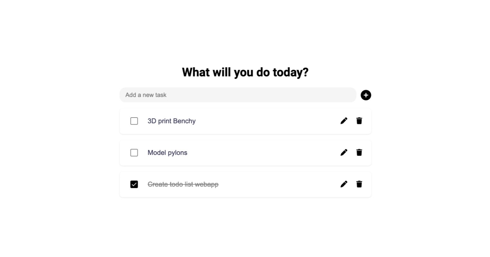

# todo-list

Minimalist todo list app based on the [todo list assignment on The Odin Project](https://www.theodinproject.com/lessons/node-path-javascript-todo-list).

## Overview

### Highlights

- Dynamic creation, editing, and deletion of todos
- localStorage persistence of user data
- Parsing objects and functions from localStorage JSON
- Webpack bundling (source map, asset loaders, HtmlWebpackPlugin)
- GitHub Pages deployment from dist folder
- ES6 modules and classes

### Preview

[Live webapp on GitHub pages](https://imkevinchu.github.io/todo-list/)

